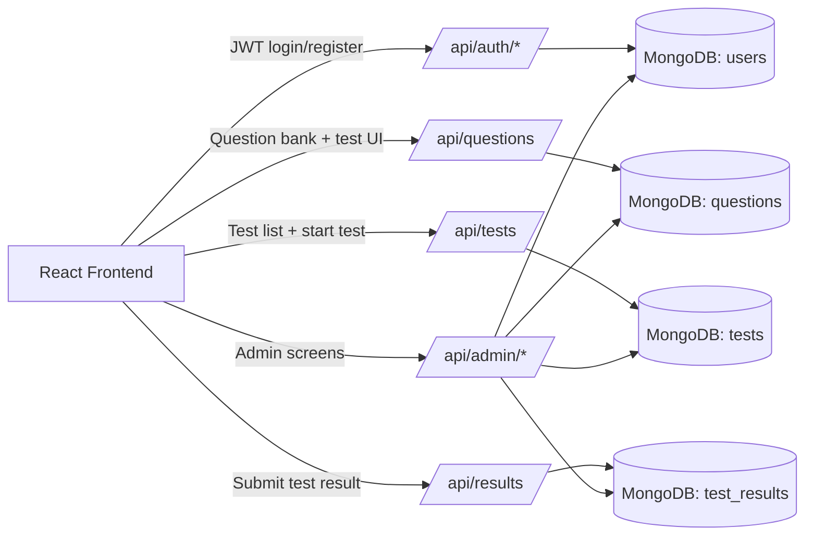

# Scorelytics

Scorelytics is a full-stack aptitude test platform with:

- **Frontend**: React + Vite (dev on `http://localhost:5173`)
- **Backend**: Spring Boot + Spring Security + MongoDB Atlas (API on `http://localhost:8080/api`)

## Quick start (local)

### Prerequisites

- Node.js 18+
- Java 21+
- Maven
- MongoDB Atlas cluster (or local MongoDB for dev)

### 1) Backend (Spring Boot)

Create backend env file:

- Copy `java-backend/.env.example` → `java-backend/.env`
- Set **at minimum**:
  - `MONGODB_URI` (MongoDB Atlas connection string)
  - `JWT_SECRET` (any string; the app derives a safe HS512 key if too short)

Run:

```bash
cd java-backend
mvn spring-boot:run
```

Backend health check:

- `GET http://localhost:8080/api/tests`

### 2) Frontend (React)

Create frontend env file:

- Copy `.env.example` → `.env`
- Set `VITE_API_BASE_URL=http://localhost:8080/api`

Run:

```bash
npm install
npm run dev
```

## API summary

### Auth

- `POST /api/auth/register`
- `POST /api/auth/login`
- `GET /api/auth/me` (requires `Authorization: Bearer <token>`)

### Questions (admin)

- `GET /api/questions` (public)
- `POST /api/questions` (admin)
- `PATCH /api/questions/:id` (admin)
- `DELETE /api/questions/:id` (admin)

### Tests (admin)

- `GET /api/tests` (public)
- `POST /api/tests` (admin)
- `PATCH /api/tests/:id` (admin)
- `DELETE /api/tests/:id` (admin)

### Results

- `GET /api/results` (public)
- `GET /api/results/user/:userId` (public)
- `POST /api/results` (requires `USER` or `ADMIN`)

## ER Diagram (Mongo Logical Model)

```mermaid
erDiagram
    USERS {
        string id PK
        string email
        string password
        string name
        string photoUrl
        string role "USER|ADMIN"
        date createdAt
        date lastSeenAt
    }

    QUESTIONS {
        string id PK
        string text
        array options
        array optionImages
        string correctAnswer
        string category "Quant|Reasoning|Verbal"
        string imageUrl
        string createdAt
        string explanation
        string instructions
    }

    TESTS {
        string id PK
        string title
        string category "Quant|Reasoning|Verbal|Mixed"
        int duration
        array questionIds "FK list -> QUESTIONS.id"
        string createdAt
    }

    TEST_RESULTS {
        string id PK
        string userId FK
        string testId FK
        string testTitle "snapshot"
        int score
        int totalQuestions
        float accuracy
        json subjectWise
        array weakAreas
        string userName "snapshot"
        string userPhoto "snapshot"
        string timestamp
    }

    USERS ||--o{ TEST_RESULTS : attempts
    TESTS ||--o{ TEST_RESULTS : produces
    TESTS }o--o{ QUESTIONS : includes_via_questionIds
```



## Full-Stack Flow (High Level)



Notes:
- `TESTS.questionIds` stores question references as an ID array (document-reference style).
- `TEST_RESULTS` keeps snapshot fields (`testTitle`, `userName`, `userPhoto`) for stable historical reporting.
## Environment variables

### Frontend (`.env`)

Only client-safe values should go here.

```env
VITE_API_BASE_URL=http://localhost:8080/api
GEMINI_API_KEY=your_key_here
```

### Backend (`java-backend/.env`)

Never commit this file.

```env
MONGODB_URI=mongodb+srv://<user>:<password>@<cluster>/<db>?retryWrites=true&w=majority
JWT_SECRET=change_me
JWT_EXPIRATION=86400000
SERVER_PORT=8080
LOG_LEVEL=DEBUG
```

## Troubleshooting

### Port 8080 already in use

Kill the process using port 8080, then restart the backend.

### MongoDB Atlas connection fails

- Ensure your Atlas **Network Access** allows your IP (or temporarily `0.0.0.0/0` for dev).
- Ensure the connection string includes the database name.

## More docs

- Frontend: `FRONTEND_SETUP.md`
- Full integration notes: `INTEGRATION_GUIDE.md`
- Backend env setup: `java-backend/ENV_SETUP.md`

